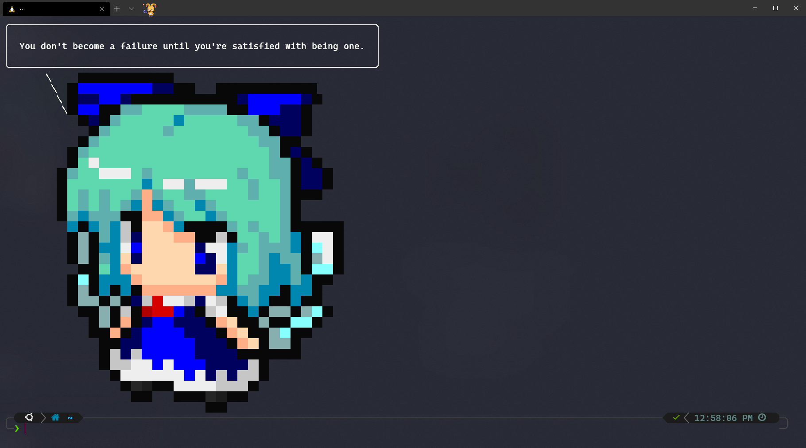
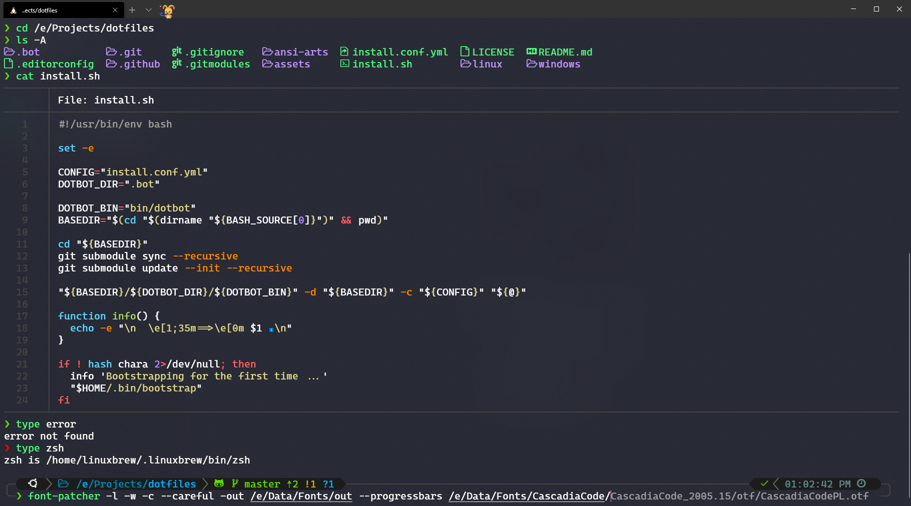

# Latipun's Dotfiles

[](https://discord.gg/Zw8d3wy "Emperor Ruppy's Kingdom")

This is my personalized dotfiles that I use on my machines. But what is dotfiles?
Simply, dotfiles are configuration files of Unix (and some Windows) programs that are
stored in the user's home directory. These files usually named with leading dot (`.`) hence the names are dotfiles (`.files`).

The interesting part of dotfiles are it can be shared to different machine to have
the same program configurations. Then the project like this are awesome while the
settings are personalized and opinionated, it can be inspiration for other people.
While it can be simply copy paste the dotfiles to different machines, the automation
script will be much more interesting and ease to use with just one or two to three
run scripts and all the configuration files installed. That's what the project like
this trying to achieve.

So, [fork it](https://github.com/latipun7/dotfiles/fork), customize to your personalized
settings, remove what you don't need, add what you need. Or create [new repo](https://github.com/new)
and make this repo and other dotfiles repo as inspirations.

### Screenshots




## What in this Repo

This repo contains my personal configuration for Linux and Windows.

- Only support Ubuntu / Debian based Linux Distro with `apt`.
- Support both normal linux or WSL.
- _Windows dotfiles coming soon (Currently only some backup files, no automation)_.

**Important**: You need [nerd fonts][nerd-fonts] in your terminal.
Install the font of your choosing and use that font in your terminal.
This repo already included [font that I personally use][my-font].

## Installation

If you are on Linux, run this command to **install** this dotfiles:

- Install this dotfiles:

  ```bash
  bash -c "$(curl -fsSL https://ruppy.io/install-dotfiles)"
  ```

- Exit current terminal session: `exit`, then start new terminal session
- Run `nvm install node && nvm use node && bootstrap`
- Now this configuration already installed in your machine.

### Tips

If you follow the steps above, you can runs the following commands:

- Run `bootstrap` regularly to update apps/packages.
- Run `dotfiles` or `dotfiles -i` or `dotfiles --install` to install.
- Run `dotfiles -u` or `dotfiles --update` to update the dotfiles.
- Run `chara` to see the characters saying some quotes.
- Run `weather` or `weather "desired city"` to check weathers on that city.

## Resources

Here are list of resources for you to get started dive into this kind of project,
and this list is what actually inspired me to get started with it.

- [Awesome dotfiles][awe-dot] - A curated list of dotfiles resources.
- [Managing your dotfiles][manage] - Article of how to manage dotfiles with [dotbot][dotbot]
- [Anish's dotfiles][anish] - Dotbot author's personal dotfiles
- [Holman's dotfiles][holman] - Nice zsh dotfiles
- [Bash manual][bash] - Bash documentation to write your own scripts

## Information

I'm new with bash/shell scripting, so my script would be lot of dirty and not optimized
for performance. Suggestion and criticism are open.

[MIT License](./LICENSE) © 2020, Latipun7

<!-- Variables -->

[awe-dot]: https://github.com/webpro/awesome-dotfiles#readme "Awesome Dotfiles"
[manage]: https://www.anishathalye.com/2014/08/03/managing-your-dotfiles/ "Managing your dotfiles"
[dotbot]: https://github.com/anishathalye/dotbot "Dotbot - dotfiles management tools"
[anish]: https://github.com/anishathalye/dotfiles "Anish's dotfiles"
[holman]: https://github.com/holman/dotfiles "Holman does dotfiles"
[bash]: https://www.gnu.org/software/bash/manual/bash.html "Bash Manual"
[nerd-fonts]: https://www.nerdfonts.com/ "NerdFonts"
[my-font]: ./assets/fonts/Caskaydia%20Cove%20PL%20Regular%20Nerd%20Font%20Complete%20Windows%20Compatible.otf "CaskaydiaCove NF (self-patched)"
