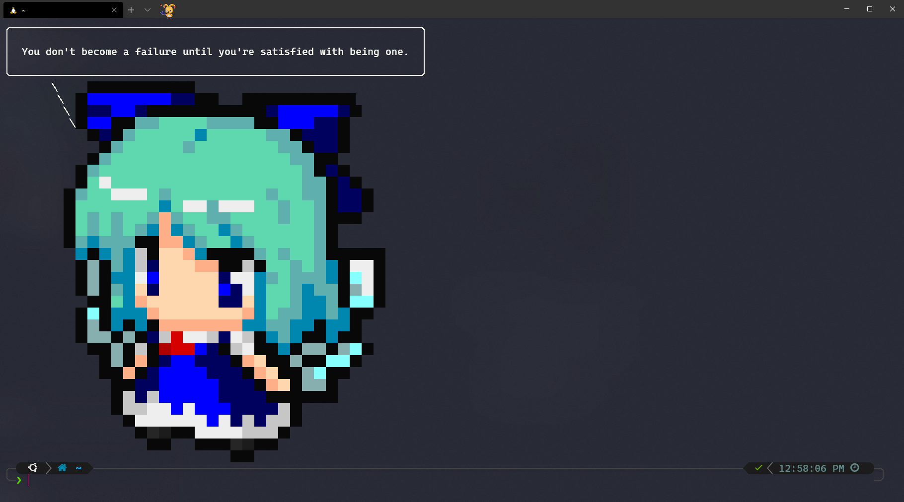
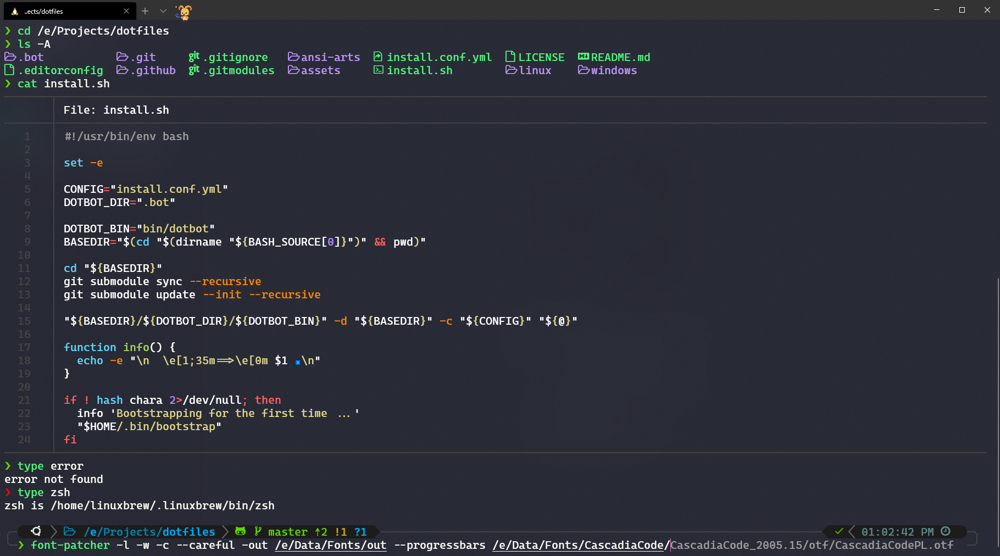

# Latipun's Dotfiles

[![Discord][discord-image]][discord-url]
[![GitHub Workflow Status][workflow-image]][workflow-url]

This is my personalized dotfiles that I use on my machines. But what is dotfiles?
Simply, dotfiles are configuration files of Unix (and some Windows) programs
that are stored in the user's home directory. These files usually named with
leading dot (`.`) hence the names are dotfiles (`.files`).

The interesting part of dotfiles are it can be shared to different machine to have
the same program configurations. Then the project like this are awesome while the
settings are personalized and opinionated, it can be inspiration for other people.
While it can be simply copy paste the dotfiles to different machines, the automation
script will be much more interesting and ease to use with just one or two to three
run scripts and all the configuration files installed. That's what the project like
this trying to achieve.

So, [fork it](https://github.com/latipun7/dotfiles/fork), customize to your personalized
settings, remove what you don't need, add what you need. Or create [new repo](https://github.com/new)
and make this repo and other dotfiles repo as inspirations.

## Screenshots




## What in this Repo

This repo contains my personal configuration for Linux and Windows managed by [chezmoi](https://chezmoi.io).

**Important**: You need [nerd fonts][nerd-fonts] in your terminal.
Install the font of your choosing and use that font in your terminal.
Personally, I use [Delugia Font][my-font].

## Installation

For \*nix, simply run:

```bash
bash -c "$(curl -fsLS https://github.com/latipun7/dotfiles/raw/main/install.sh)"
```

## Resources

Here are list of resources for you to get started dive into this kind of project,
and this list is what actually inspired me to get started with it.

- [Awesome dotfiles][awe-dot] - A curated list of dotfiles resources.
- [Bash manual][bash] - Bash documentation to write your own scripts

[MIT License](./LICENSE) © Latipun7

<!-- Variables -->

[discord-image]: https://img.shields.io/discord/758271814153011201?label=Developers%20Indonesia&logo=discord&style=flat-square
[discord-url]: https://discord.gg/njSj2Nq "Chat and discuss at Developers Indonesia"
[workflow-image]: https://img.shields.io/github/workflow/status/latipun7/dotfiles/%E2%9A%99%F0%9F%A4%96?label=CI&logo=github-actions&style=flat-square
[workflow-url]: https://github.com/latipun7/dotfiles/actions "GitHub Actions"
[awe-dot]: https://github.com/webpro/awesome-dotfiles#readme "Awesome Dotfiles"
[bash]: https://www.gnu.org/software/bash/manual/bash.html "Bash Manual"
[nerd-fonts]: https://www.nerdfonts.com/ "NerdFonts"
[my-font]: https://github.com/adam7/delugia-code/releases "Download Delugia Font"
